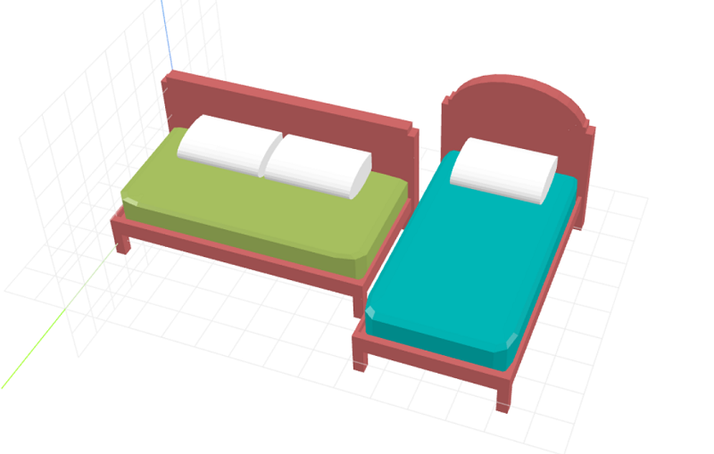

# craft-bed

Parameterized bed model.

### Install
	$ npm install craft-bed

### Parameters
- size: scales model
- width: adjusts width of bed 
- length: adjusts length of bed
- mattressHeight: adjusts height of mattress
- legHeight: adjusts height of frame legs
- headRound: adjusts between rounded and standard headboard
	- 0 = standard, 1 = rounded
- bedFrame: adjusts between mattress only and mattress + frame
	- 0 = mattress, 1 = mattress + frame

### Example
```html
<craft>
	<craft name="bed" module="craft-bed"/>
	<bed width="76" length="80"></bed>
	<bed bedFrame="0" mattressHeight="15"/></bed>
	<bed size="0.5" headRound="0"></bed>
	<bed></bed>
</craft>
```


